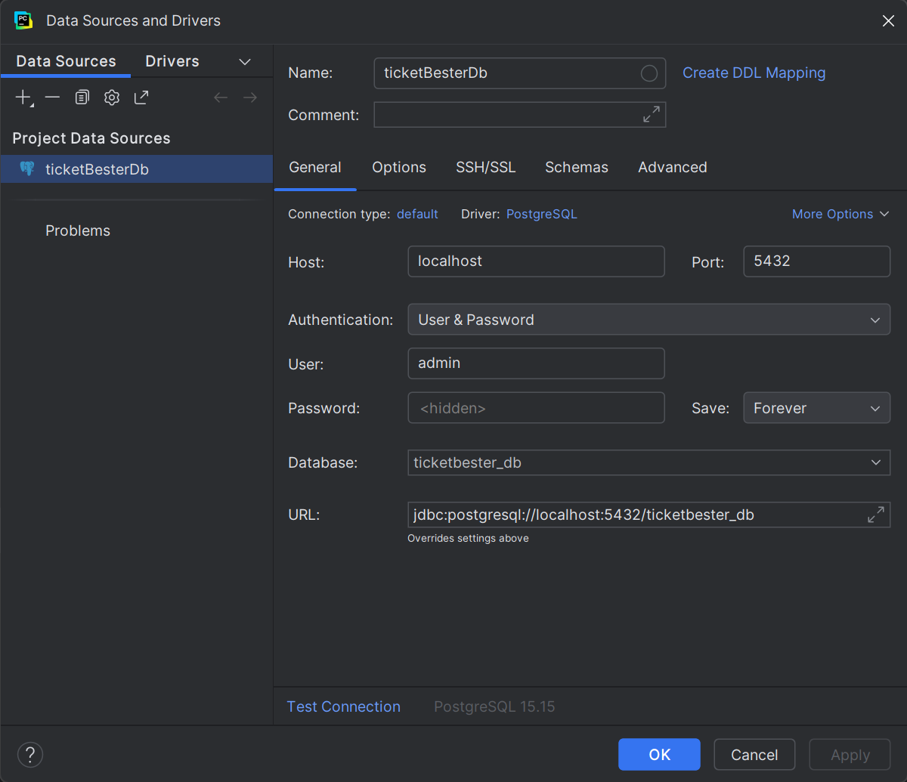

# TicketBester
The semestrial project for the courses 201.2 - Genie Logiciel and 201.3 - Bases de Données Relationnelles at HES-SO Valais/Wallis (HEI).

## Docker Setup

To launch the infrastructure (PostgreSQL + pgAdmin):

1. Make sure **Docker Desktop** is installed and running.
2. Open a terminal in this folder.
3. Run the command:
   ```bash
   docker-compose up -d
    ```

## DB
### Link
1. Open Docker
2. Run the ticketbester_db docker
3. Follow the tutorial on https://www.jetbrains.com/help/pycharm/postgresql.html#connect-to-postgresql-database
4. Enter these information :



5. Test the connection, and if you have a green confirmation you can click on ok.

### Create
The fist time after you've linked to the database.
1. Open a new terminal
2. Run the command :
   ```bash
   psql -U admin -h localhost -d ticketbester_db -f ./src/db/create_db.sql
    ```
4. Enter the db password, and validate

### Reset
The other times, after changes, you can just run this.
The reset drops all the tables and then execute the create_db.sql file automatically.
1. Open a new terminal
2. Run the command :
   ```bash
   psql -U admin -h localhost -d ticketbester_db -f ./src/db/create_db.sql
    ```
4. Enter the db password, and validate
